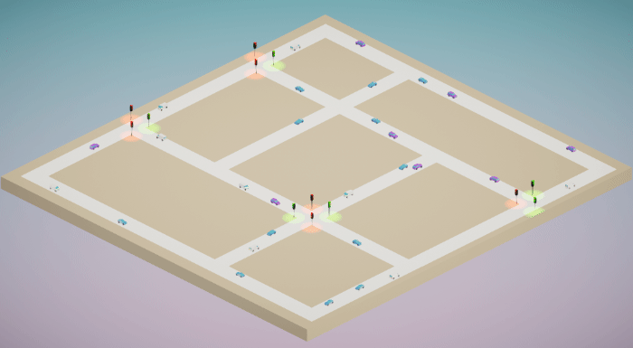
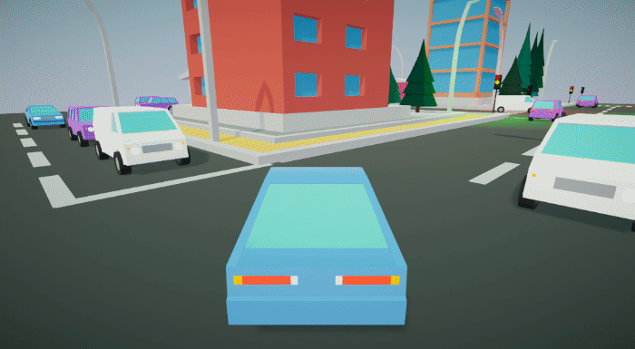

# Unity Traffic Simulation

Traffic Simulation is a Unity asset that lets you easily simulate simple traffic into your scene.

Developed / Tested with Unity 2018.3.x.

## How to use
### Basic
Traffic Simulation uses NavMesh so you will have to bake your roads. Also make sure that your roads/terrain have a collider!

### Create a Traffic System
1. Create a Traffic System via *Component -> Traffic Simulation -> Create Traffic Simulation*
2. Select the *Traffic System* object in the hierarchy
3. Press *Ctrl + Left Click* to place the first waypoint of the segment (create a new segment)
4. If you press *Shift + Left Click* it will continue the segment, otherwise step 3. to create a new segment. Usually a segment stops at an intersection. **Note that the vehicle will follow the waypoints depending on the order you placed them.**
5. The next step is a bit tedious at the moment. Basically you have to link the segments between each other - so when the the segment ends at an intersection, you can go to a certain number of segments which will be picked up randomly by the CarAI. To do so, select a segment and plug your next segments in the *Next Segments* parameter.
6. To create an intersection, press *Alt + Left Click* and select the intersection type (stops or traffic lights).
7. Set the dimension of the intersection's box collider so it covers all the last waypoints (cf: below image). Also make sure that the height of the box collider is high enough to collide with your vehicle.

#### Editing Segments / Intersections
If you delete existing segments or intersections, you will have to press the *Re-Structure Traffic System* button in order to rebuild the system.

#### Stops
You don't have to setup anything for the stops. Simply select *STOP* as the intersection type. The first vehicle to arrive will be the first one to leave.

#### Traffic Lights
Setting up a traffic light requires a little bit more steps:
1. Select *TRAFFIC_LIGHT* as intersection type.
2. Configure the two light groups by placing the segment on the group they belong to. Usually, two opposite lane share the same light group. In the example below, you would have to place the two segments ending with the blue round in one group and the two segments with the gray round on the other group.

3. Changing the light of your 3D model can be done via your own script. An example of this is provided in the example folder.

### Vehicle Configuration
1. Add VehiclePhysic script and the usuals (wheel colliders, etc.) to your car. See example scenes for reference on how to do so. Note: You can also use another car's physics package such as Edy's Vehicle Physics - if that's the case, you will have to modify the *MoveVehicle* method in *CarAI* to make it move according to the physic asset you are using.
2. Create an empty *GameObject* as a child of your car and place it in front of your vehicle. This will be used as a starting location to cast your rays.
3. Add *CarAI* script on your vehicle and set the variables. See examples for reference. Pay attention to the **Raycast** section, depending on the size of your environment you will have to set the right ray amount, length and spacing.
4. Set your vehicle with the tag "AutonomousVehicle" and also a layer (applied to children too!) with the name "AutonomousVehicle"
5. Place your vehicle on a segment. When your game run, it will automatically detect on which segment you are in and what is the nearest waypoint of that segment your navmesh has to reach.

## Todo
- Add multiple lanes.
- Possibility to choose from an intersection which lanes has a stop and which doesn't. At the moment each lanes of a "Stop" intersection are set to stop. 
- Possibility to add a speed limitation on certain segments.
- Pedestrians
- ...

## Assets used
- [Minimalist Free](https://assetstore.unity.com/packages/vfx/shaders/minimalist-free-lowpoly-flat-gradient-shader-96148)  : Gradient skybox for demo scene
- [Polarith AI Free](https://assetstore.unity.com/packages/tools/ai/polarith-ai-free-movement-steering-92029) : Using their vehicle physic class as well as their 3D car models for the demo scene
- [Cartoon Lowpoly City Free](https://www.turbosquid.com/FullPreview/Index.cfm/ID/1294342) : Using the city for example scene 2

---

MIT License

Copyright (c) 2019 Matthieu Cherubini

Permission is hereby granted, free of charge, to any person obtaining a copy of this software and associated documentation files (the "Software"), to deal in the Software without restriction, including without limitation the rights to use, copy, modify, merge, publish, distribute, sublicense, and/or sell copies of the Software, and to permit persons to whom the Software is furnished to do so, subject to the following conditions:

The above copyright notice and this permission notice shall be included in all copies or substantial portions of the Software.

THE SOFTWARE IS PROVIDED "AS IS", WITHOUT WARRANTY OF ANY KIND, EXPRESS OR IMPLIED, INCLUDING BUT NOT LIMITED TO THE WARRANTIES OF MERCHANTABILITY, FITNESS FOR A PARTICULAR PURPOSE AND NONINFRINGEMENT. IN NO EVENT SHALL THE AUTHORS OR COPYRIGHT HOLDERS BE LIABLE FOR ANY CLAIM, DAMAGES OR OTHER LIABILITY, WHETHER IN AN ACTION OF CONTRACT, TORT OR OTHERWISE, ARISING FROM, OUT OF OR IN CONNECTION WITH THE SOFTWARE OR THE USE OR OTHER DEALINGS IN THE SOFTWARE.